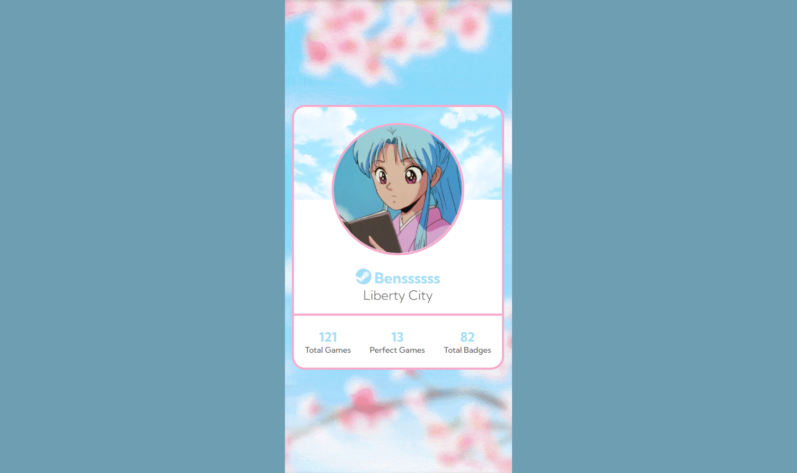

# Steam Account Statistics Page
### Statistics Page Featuring Data About a Steam Account

---

# Processo
### Design e layout feito usando pacote Adobe 

## Fazer design e planejamento

1 - Obter referência e layout

2 - Escolher tema e obter assets orginais (foto de perfil)

3 - Escolher cores (palheta baseada nas cores da personagem de perfil)

4 - Buscar assets como "fundo geral animado (gif)" e produzir a carta a carta

### Aqui há um pdf com todos os assets, design, e referência de layout
([Design-steam-profile-card-assets](https://drive.google.com/file/d/1bpc6Mc0n06vqg8AXu04KQtGG_Hr4H723/view?usp=sharing))

---

## Escrever codigo de uma carta por vez, 

1 - Inserir background (colocando um gif usando a tag )

2 - Posicionar nome e descrição

3 - Posionar foto de perfil e fundo da carta usando display: absolute e relative 

4 - Adicionar título, subtítulo, e logo

5 - Posicionar uma linha decorativa e abaixo uma sessão de dados estátisticos 

6 - Implementar "hover:" no título, e nas estátisticas (total games...)

### Fazer versionamento quando;
- html escrito
- css escrito
- clean code
- ajuste de metadata

7 - Centralizar a carta usando display: flex (justify-content e align-items)

8 - Definir min-width, para que o conteúdo se adapte a larguras diferentes de tela

9 - Reescrever CSS/HTML Code, reduzindo e removendo código desnecessário utilizando princípios de Clean Code, e combinação de classes

# Tecnologias utilizadas
- HTML5 Markup 
- CSS
- Clean Code
- Photoshop
- Illustrator
- Premiere (edição do gif usado no fundo da página)

# O que eu aprendi

#### CSS
- Prática de "position: absolute;"/ "position: relative;" e propriedades do display: flex (justify-content, align-items), usar "transition:;" em elementos com :hover

#### HTML5
- Maior organização do projeto usando tags mais semânticas, colocando "img" dentro de "pictures", e separando partes do site com "section", inserindo "meta-descriptions", escrevendo um "title" mais descritivo e inserindo um "favicon"

# Dificuldades
- Organizar-posicionar elementos um dentro/em cima do outro (porém menos dificuldade por já ter usado "position:;" em outro projeto)
---

# Autor
### Jefferson Augusto (a.k.a Benssssss) 
[Linkedin](https://www.linkedin.com/in/benssssss/)

## Projeto Nº4
